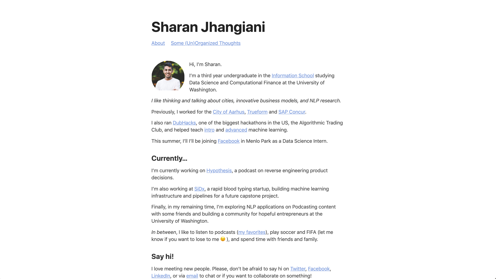

# [sharanjhangiani.com](https://sharanjhangiani.com)

This is my personal website. It's a static blog built with Jekyll and hosted on Github.

If you would like to use it as the basis for your own website, feel free to fork this open source Jekyll theme I used: [Point Theme](https://github.com/katavie/point-theme). All credit goes to [Katherine Huang](http://katmh.com/) for the template, I only edited it slightly for my own usage. 
